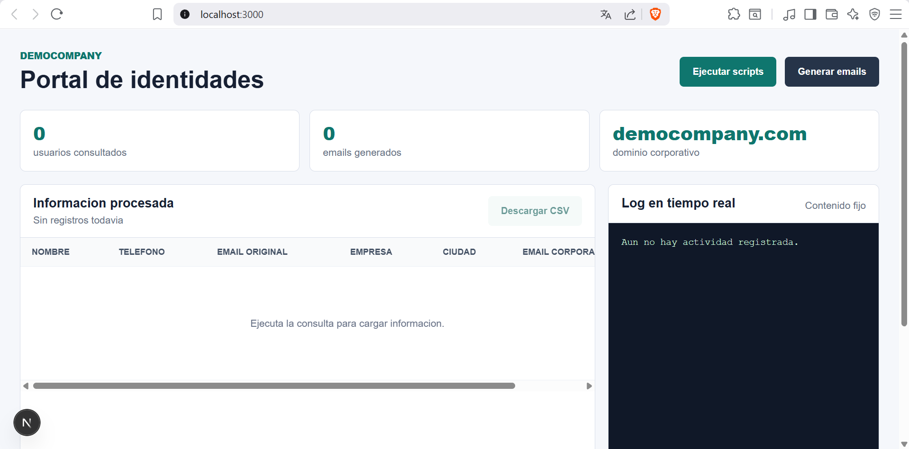
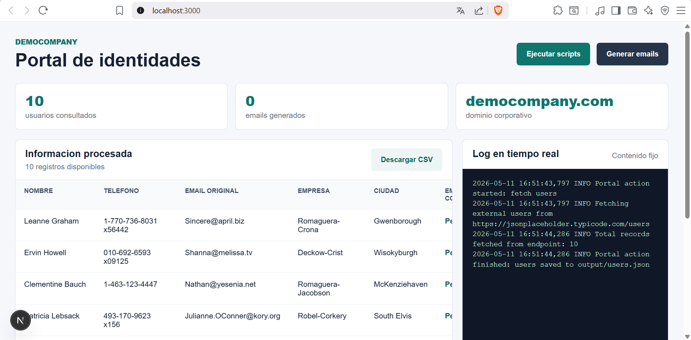
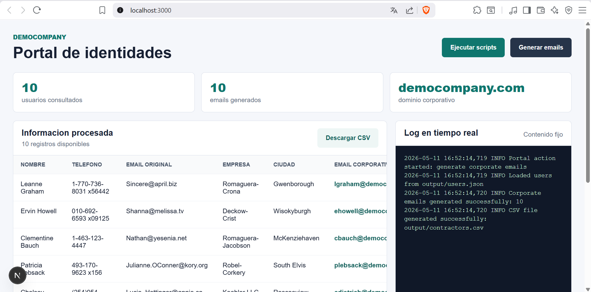

# Contractor Identity Portal

Proyecto Python 3.13 con Docker Compose, uv y Next.js para consultar usuarios externos,
generar correos corporativos y visualizar el resultado desde CLI o desde un portal web.

## Objetivo

La aplicacion consume usuarios desde un endpoint configurable, transforma la informacion
relevante y genera correos corporativos bajo el dominio configurado.

El proyecto no genera tokens JWT, no cifra correos y no guarda hashes del email original.
La salida se mantiene simple y auditable:

- nombre completo
- telefono
- email original
- empresa
- ciudad
- email corporativo generado

## Requisitos

Antes de ejecutar el proyecto, asegurese de tener instalado:

- Docker
- Docker Compose
- Make

No es necesario instalar Python, uv o Node.js localmente. El proyecto usa contenedores
para ejecutar tanto el backend Python como el portal Next.js.

## Configuracion

El proyecto incluye un archivo `.env.example` con las variables necesarias:

```env
DEMOCOMPANY_USERS_URL=https://jsonplaceholder.typicode.com/users
DEMOCOMPANY_DOMAIN=democompany.com
DEMOCOMPANY_TIMEOUT_SECONDS=10
```

Para ejecutar localmente, el `Makefile` crea un `.env` con esos valores por defecto.
Si desea cambiar el endpoint, dominio corporativo o timeout, edite `.env`.

## Primer Uso

Inicialice la estructura del proyecto:

```sh
make bootstrap
```

Este comando solo crea archivos e inicializa git. No construye imagenes, no ejecuta
tests y no corre la aplicacion.

## Ejecucion Por CLI

Para ejecutar el flujo desde linea de comandos:

```sh
make bootstrap-run
```

Este comando consulta usuarios, genera correos corporativos y crea:

- `output/contractors.csv`
- `logs/app.log`

Tambien puede ejecutar el comando directamente dentro de Docker Compose:

```sh
docker compose run --rm app uv run democompany-identities --output output/contractors.csv --log-file logs/app.log
```

## Ejecucion Del Portal Web

Instale las dependencias del portal:

```sh
make web-install
```

Levante el portal y la API Python:

```sh
make web-dev
```

Abra el navegador en:

```text
http://localhost:3000
```

El portal web permite:

- ejecutar la consulta de usuarios
- ver los usuarios en una tabla
- generar correos corporativos
- ver el log de la sesion actual
- descargar la tabla visible en formato CSV

## Flujo En El Portal

1. Abra `http://localhost:3000`.
2. Presione `Ejecutar scripts` para consultar los usuarios externos.
3. Revise la tabla con la informacion consultada.
4. Presione `Generar emails` para crear los correos corporativos.
5. Use `Descargar CSV` para descargar la tabla actual.

El cuadro de log del portal no lee el archivo `logs/app.log`. Solo muestra el log
generado por la accion actual de la sesion web.

## Regla De Generacion De Emails

El email corporativo se genera con base en el nombre del usuario y el dominio configurado.
La regla evita direcciones demasiado cortas:

- si `inicial + apellido` tiene 5 o mas caracteres, se usa esa forma
- si queda por debajo de 5 caracteres, se agregan letras del primer nombre
- si hay duplicados, se agrega un consecutivo numerico

Ejemplos:

- `Leanne Graham` -> `lgraham@democompany.com`
- `John Doe` -> `jodoe@democompany.com`
- `Nicholas Runolfsdottir V` -> `nichv@democompany.com`

## Evidencia Visual

Pagina inicial limpia:



Pagina despues de ejecutar la consulta de usuarios:



Pagina despues de generar correos corporativos:



## Estructura Del Proyecto

```text
.
|-- app/                         # Portal web Next.js
|   |-- api/                     # Rutas API usadas por la UI
|   |-- globals.css              # Estilos globales
|   |-- layout.tsx               # Layout principal
|   `-- page.tsx                 # Pantalla del portal
|-- img/                         # Capturas de evidencia
|-- logs/                        # Logs generados por CLI
|-- output/                      # CSV y JSON generados
|-- src/democompany_identities/  # Backend Python
|-- tests/                       # Pruebas unitarias
|-- docker-compose.yml           # Servicios app, api y web
|-- Dockerfile                   # Imagen Python con uv
|-- Makefile                     # Comandos de automatizacion
|-- package.json                 # Dependencias del portal Next.js
`-- pyproject.toml               # Dependencias y config Python
```

## Componentes Principales

- `client.py`: consume el endpoint externo de usuarios.
- `emailing.py`: normaliza nombres y genera emails corporativos.
- `transform.py`: transforma usuarios externos en identidades de contratistas.
- `csv_exporter.py`: escribe el CSV final.
- `service.py`: coordina el flujo CLI.
- `web_actions.py`: acciones usadas por el portal web.
- `portal_api.py`: API HTTP simple usada por Next.js dentro de Docker Compose.

## Comandos Make

```sh
make bootstrap
```

Crea archivos e inicializa git.

```sh
make bootstrap-verify
```

Construye la imagen, actualiza lock, formatea, ejecuta lint y corre tests.

```sh
make bootstrap-run
```

Ejecuta el flujo CLI y genera el CSV.

```sh
make web-install
```

Instala dependencias del portal Next.js dentro del contenedor Node.

```sh
make web-dev
```

Levanta el portal web y la API Python.

```sh
make web-build
```

Compila el portal Next.js.

```sh
make test
```

Ejecuta las pruebas Python.

```sh
make clean
```

Elimina artefactos de ejecucion local.

## Pruebas

Para ejecutar las pruebas:

```sh
make test
```

O directamente:

```sh
docker compose run --rm --build app uv run pytest
```

## Salidas Generadas

El flujo CLI genera:

- `output/contractors.csv`
- `logs/app.log`

El portal web puede generar:

- `output/users.json`
- `output/contractors.json`
- `output/contractors.csv`

La descarga desde el boton `Descargar CSV` exporta la tabla visible en el navegador.

## Notas De Seguridad Y Privacidad

- `.env` esta ignorado por git para evitar publicar parametros locales.
- `.env.example` documenta las variables esperadas sin exponer secretos reales.
- El proyecto no incluye datos sensibles de una empresa especifica.
- El nombre, documentacion y variables se mantienen genericos para evitar divulgar
  informacion del proceso o de la compania.
